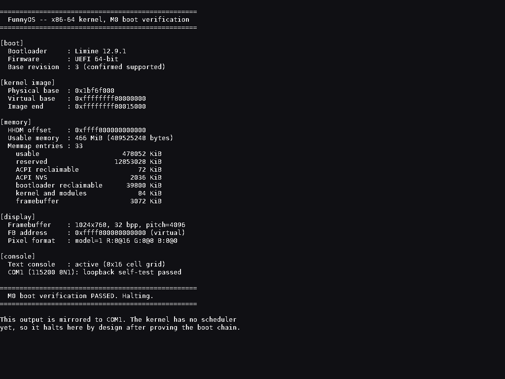

# FunnyOS

**中文** | [English](#english)

原生 x86-64 操作系统，内建 8086 虚拟机，以原生执行 16 位 DOS 程序为核心使命。

DOS 在这里扮演两重角色：**设计参照系**（继承小内核、直白分层、命令行交互的哲学，抛弃无内存保护、崩溃即整机崩溃的缺陷）和**测试语料库**（`microsoft/MS-DOS` 能编译出真实的 `.COM`/`.EXE`，是验证模拟器兼容性的现成素材）。

完整架构设计见 [docs/DESIGN.md](docs/DESIGN.md)（中文）。

---

## 当前状态

**M0（引导闭环）已完成并通过验证。**

内核能通过 Limine 进入 64 位长模式，引导协议的全部请求（内存映射、HHDM、帧缓冲、固件类型、内核映像地址）解析正确。输出同时送往两条通道：**串口**（QEMU 可无头捕获，供自动化断言）和**帧缓冲文本控制台**（内建 8×16 点阵字体的字符网格，带光标与滚屏），所以在 VMware、VirtualBox 或真机上直接开机就能看到画面，不需要串口线。

传统 BIOS 与 UEFI 两条引导路径均有自动化测试覆盖并通过（各 9 项断言），两条路径的屏幕输出也都有人工截图确认。`make run` 可交互运行，`bash tools/screenshot.sh` 可无头截图。



下一步是 M1：内核基础设施（物理内存管理、页表、IDT、异常处理、APIC 与定时器）。

## 构建环境

构建在 **WSL2 Ubuntu** 中进行。裸机 x64 的工具链在 Linux 上是原生的，这是最省事的路径。Visual Studio / MSVC 不适合裸机内核：无法完全控制链接布局，也没有关闭 CRT 与 SEH 的开关。

### 一次性环境准备

```bash
sudo apt-get update
sudo apt-get install -y build-essential nasm qemu-system-x86 xorriso mtools gdb ovmf
```

随后拉取 Limine 引导加载器（脚本幂等，可重复执行）：

```bash
bash tools/setup-limine.sh
```

### 构建与测试

```bash
make            # 构建内核与可引导 ISO
make test       # 无头启动并断言（BIOS 路径）
make test-uefi  # 无头启动并断言（UEFI 路径）
make test-all   # 两条路径都测
make run        # 在带显示的 QEMU 中交互运行
make export     # 把 ISO 复制到 dist/ 目录
```

`make test` 会自动优先使用 KVM 硬件加速，无 KVM 时回退到 TCG 软件模拟。

## 目录结构

```
FunnyOS/
├── boot/
│   ├── limine.conf              引导配置
│   └── limine/                  Limine 二进制与协议头文件（由脚本获取，不入库）
├── kernel/
│   ├── arch/x86_64/entry.asm    长模式入口（建立内核栈）
│   ├── boot/bootinfo.c          Limine 引导请求与访问接口
│   ├── console/
│   │   ├── serial.c             16550 UART 驱动（含回环自检）
│   │   ├── fb.c                 帧缓冲文本控制台（光标、滚屏）
│   │   ├── font8x16.c           内建点阵字库（由脚本生成，勿手改）
│   │   └── kprintf.c            输出分发：串口 + 帧缓冲双写
│   ├── include/funnyos/         内核头文件
│   ├── main.c                   内核入口
│   └── panic.c                  致命错误处理
├── libk/                        内核基础库（memcpy/memset/printf 等）
├── docs/
│   ├── DESIGN.md                架构设计文档
│   └── limine-*.md              Limine 协议、配置、用法文档（由脚本获取）
├── tools/
│   ├── setup-limine.sh          获取 Limine（幂等）
│   ├── run-qemu-test.sh         启动测试与断言
│   ├── screenshot.sh            无头截图（验证帧缓冲实际渲染）
│   ├── gen-font.py              从 TTF 生成 8x16 点阵字库
│   ├── github-setup.sh          GitHub 仓库初始化
│   ├── fix-line-endings.sh      行尾符诊断与修复
│   └── wsl-env-check.sh         构建环境自检
├── linker.ld                    内核链接脚本
└── Makefile
```

## 三个必须知道的坑

以下三点都是实际踩出来的，不是理论风险。

### 1. 构建产物不在项目目录里

构建输出到 **`/var/tmp/funyos-build`**，而不是项目目录。这不是洁癖：

在 `/mnt/c`（9p 协议挂载）上由 WSL 创建的文件，如果 WSL 在数据真正落盘之前被终止，会进入一种损坏状态——Win32 API（`dir`、PowerShell `Get-ChildItem`）能列出文件、长度也正确，但 WSL 与 MSYS 的 `stat()` 一律返回 `ENOENT`，而且 `del` / `Remove-Item` 也删不掉。本项目实测已经产生过两个这样的幽灵文件（`funyos.elf` / `funyos.iso`），需要重启或 `chkdsk` 才能清除。

除可靠性之外，9p 上编译大量小文件也明显慢于原生文件系统。

源码仍然留在项目目录（Windows 侧可见、可版本控制），只有构建产物在 WSL 内部。

### 2. 内核编译期必须禁用 red zone 和向量寄存器

`-mno-red-zone` 和 `-mgeneral-regs-only` 不是可选优化：

- x86-64 的 red zone 假设栈指针之下 128 字节可以安全使用，而中断处理会破坏这个假设。
- 内核目前不保存 FPU/SSE 状态，编译器生成的任何浮点或向量指令都会在后续上下文切换时静默损坏数据。

这两个标志写在 `Makefile` 的 `CFLAGS` 里，不要移除。

### 3. 内核路径用 `fslabel()`，不要用 `boot()`

`boot():` 的含义是"引导驱动器上包含配置文件的那个分区"。这依赖 Limine 成功地把引导设备和某个可读卷对应起来。某些固件/虚拟机组合做不到，Limine 会警告：

```
Could not meaningfully match the boot device handle with a volume
```

然后回退到扫描含配置的卷。配置仍然找得到，但 `boot():` 不再可解析，内核于是打不开：

```
PANIC: Failed to open executable with path `boot():/boot/funyos.elf`
```

这在 VMware Workstation 上实测触发过（同样的镜像在 QEMU 里正常，所以本地测试抓不住）。改用 `fslabel()` 后，卷是靠 ISO 9660 卷标识符定位的，完全不经过引导设备匹配这一步。

标签由 `Makefile` 里的 `VOLID` 定义，构建时会校验镜像确实带上了它——因为标签对不上会造出一个"编译通过、测试通过、但无法引导"的镜像，这种失败模式最难排查。

同理，构建**不做** `limine bios-install`、也**不加** `--protective-msdos-label`：那是为"写入 U 盘当硬盘启动"准备的，会给镜像留下 DOS 分区表，让固件有机会把光盘误判成硬盘。需要 U 盘启动版本的话，把这两步加回去即可（`Makefile` 里有说明）。

## 设计要点速查

几个已经定死、后续不该反复推翻的决策（完整论证见 [docs/DESIGN.md](docs/DESIGN.md)）：

**DOS 程序用纯软件 8086 解释器执行。** 原因是硬件层面的：x64 长模式不提供 virtual 8086 模式；而硬件虚拟化要等到 Westmere 之后的 "unrestricted guest" + EPT 才能 VMEntry 进未开启分页的实模式 guest，且复杂度完全不成比例。

**模拟器运行在 Ring 3 用户态。** 解释器主循环的性能与特权级无关，但放在用户态几乎免费地获得了 MMU 隔离——一个 DOS 程序崩溃只杀死它自己。这是 FunnyOS 明确背离 DOS 的地方。

**中断采用 IVT 改写检测模型。** 天真地拦截所有 `INT n` 会让所有 TSR 常驻程序失效，因为 TSR 正是靠改写中断向量表来劫持系统调用的。

---
---

# English

[中文](#funnyos) | **English**

A native x86-64 operating system with a built-in 8086 virtual machine, whose core purpose is running 16-bit DOS programs natively.

DOS plays two roles here: a **design reference** (keeping the small kernel, the plain layering, the command-line philosophy; discarding the lack of memory protection and the fact that one crashing program takes down the machine) and a **test corpus** (the `microsoft/MS-DOS` sources compile into real `.COM`/`.EXE` binaries, which are excellent material for validating emulator compatibility).

See [docs/DESIGN.md](docs/DESIGN.md) for the full architecture (written in Chinese).

## Status

**M0 (boot chain) is complete and verified.**

The kernel enters 64-bit long mode via Limine, and every boot protocol request (memory map, HHDM, framebuffer, firmware type, kernel image address) parses correctly. Output goes to two channels at once: **serial** (QEMU captures it headlessly for the automated assertions) and a **framebuffer text console** (a character grid backed by a built-in 8x16 bitmap font, with cursor and scrolling). That means booting it in VMware, VirtualBox or on real hardware shows something immediately, with no serial cable required.

Both legacy BIOS and UEFI boot paths are covered by automated tests and pass (9 assertions each), and the on-screen output of both paths has been confirmed by manual screenshot. `make run` boots interactively; `bash tools/screenshot.sh` captures the screen headlessly.


Next up is M1: kernel infrastructure (physical memory management, page tables, IDT, exception handling, APIC and timers).

## Build environment

Building happens in **WSL2 Ubuntu**. Bare-metal x64 toolchains are native on Linux, which makes this the path of least resistance. Visual Studio / MSVC is a poor fit for a bare-metal kernel: it does not give full control over link layout and offers no clean way to disable the CRT and SEH.

### One-time setup

```bash
sudo apt-get update
sudo apt-get install -y build-essential nasm qemu-system-x86 xorriso mtools gdb ovmf
```

Then fetch the Limine bootloader (the script is idempotent and safe to re-run):

```bash
bash tools/setup-limine.sh
```

### Build and test

```bash
make            # Build the kernel and a bootable ISO
make test       # Boot headless and assert (BIOS path)
make test-uefi  # Boot headless and assert (UEFI path)
make test-all   # Run both boot paths
make run        # Run interactively in QEMU with a display
make export     # Copy the ISO into dist/
```

`make test` prefers KVM hardware acceleration and falls back to TCG software emulation when KVM is unavailable.

## Project layout

```
FunnyOS/
├── boot/
│   ├── limine.conf              Boot configuration
│   └── limine/                  Limine binaries and protocol header (fetched, not committed)
├── kernel/
│   ├── arch/x86_64/entry.asm    Long mode entry point (sets up the kernel stack)
│   ├── boot/bootinfo.c          Limine boot requests and accessor interface
│   ├── console/
│   │   ├── serial.c             16550 UART driver with loopback self-test
│   │   ├── fb.c                 Framebuffer text console (cursor, scrolling)
│   │   ├── font8x16.c           Built-in bitmap font (generated; do not edit)
│   │   └── kprintf.c            Output fan-out: serial + framebuffer
│   ├── include/funnyos/         Kernel headers
│   ├── main.c                   Kernel entry point
│   └── panic.c                  Fatal error handling
├── libk/                        Kernel support library (memcpy/memset/printf and friends)
├── docs/
│   ├── DESIGN.md                Architecture and design decisions
│   └── limine-*.md              Limine protocol, config and usage docs (fetched, not committed)
├── tools/
│   ├── setup-limine.sh          Fetch Limine (idempotent)
│   ├── run-qemu-test.sh         Boot test and assertions
│   ├── screenshot.sh            Headless screendump (verifies actual rendering)
│   ├── gen-font.py              Rasterise a TTF into the 8x16 bitmap font
│   ├── github-setup.sh          GitHub repository bootstrap
│   ├── fix-line-endings.sh      Line ending diagnostics and repair
│   └── wsl-env-check.sh         Build environment self-check
├── linker.ld                    Kernel linker script
└── Makefile
```

## Three things you need to know

All three were hit in practice, not theorised.

### 1. Build artifacts do not live in the project directory

Build output goes to **`/var/tmp/funyos-build`**, not the project directory. This is not tidiness:

A file created by WSL on `/mnt/c` (a 9p mount) becomes corrupted if WSL is terminated before the data actually reaches disk. The result is a file that Win32 APIs (`dir`, PowerShell `Get-ChildItem`) list with a correct size, but that WSL and MSYS `stat()` report as `ENOENT` — and that `del` / `Remove-Item` cannot remove either. Two such phantom files were produced here in practice (`funyos.elf` / `funyos.iso`); clearing them needs a reboot or `chkdsk`.

Separately, compiling many small files over 9p is noticeably slower than on a native filesystem.

Sources stay in the project directory (visible from Windows, suitable for version control); only build output lives inside WSL.

### 2. The kernel must disable the red zone and vector registers at compile time

`-mno-red-zone` and `-mgeneral-regs-only` are not optional optimisations:

- The x86-64 red zone assumes the 128 bytes below the stack pointer are safe to use, which interrupt handlers will clobber.
- The kernel does not save FPU/SSE state, so any floating point or vector instruction the compiler emits would silently corrupt data on the next context switch.

Both flags live in `CFLAGS` in the `Makefile`. Do not remove them.

### 3. The kernel path uses `fslabel()`, not `boot()`

`boot():` means "the partition holding the config file, on the boot drive". That depends on Limine successfully matching the device it was booted from with a readable volume. Some firmware/VM combinations fail that match, and Limine warns:

```
Could not meaningfully match the boot device handle with a volume
```

It then falls back to scanning for a volume containing a config. The config is still found, but `boot():` no longer resolves, and the kernel cannot be opened:

```
PANIC: Failed to open executable with path `boot():/boot/funyos.elf`
```

This was observed on VMware Workstation. The same image booted fine under QEMU, so local testing does not catch it. `fslabel()` sidesteps the whole thing: it locates the volume by its ISO 9660 volume identifier, with no boot-device matching involved.

The label comes from `VOLID` in the `Makefile`, and the build verifies the image actually carries it — because a mismatched label produces an image that compiles, passes every test, and then refuses to boot, which is the nastiest failure mode there is.

For the same reason the build does **not** run `limine bios-install` and does **not** pass `--protective-msdos-label`: those exist to make an image bootable as a hard disk (a USB stick), and they leave a DOS partition table behind that gives firmware the chance to mistake the optical disc for a hard drive. If you do want a USB-bootable image, add both back (`Makefile` explains where).

## Design decisions at a glance

These are settled; the full reasoning is in [docs/DESIGN.md](docs/DESIGN.md).

**DOS programs run on a pure software 8086 interpreter.** The reason is a hardware one: x64 long mode does not provide virtual 8086 mode, and hardware virtualisation would need Westmere-era "unrestricted guest" plus EPT to enter a real-mode guest without paging enabled. The complexity is wildly out of proportion to the benefit.

**The emulator runs as a Ring 3 user-space process.** The interpreter's main loop performs identically regardless of privilege level, but running in user space buys MMU-enforced isolation for free — a crashing DOS program kills only itself. This is where FunnyOS deliberately departs from DOS.

**Interrupts use an IVT-rewrite detection model.** Naively intercepting every `INT n` would break every TSR, since TSRs hijack system calls precisely by rewriting the interrupt vector table.
