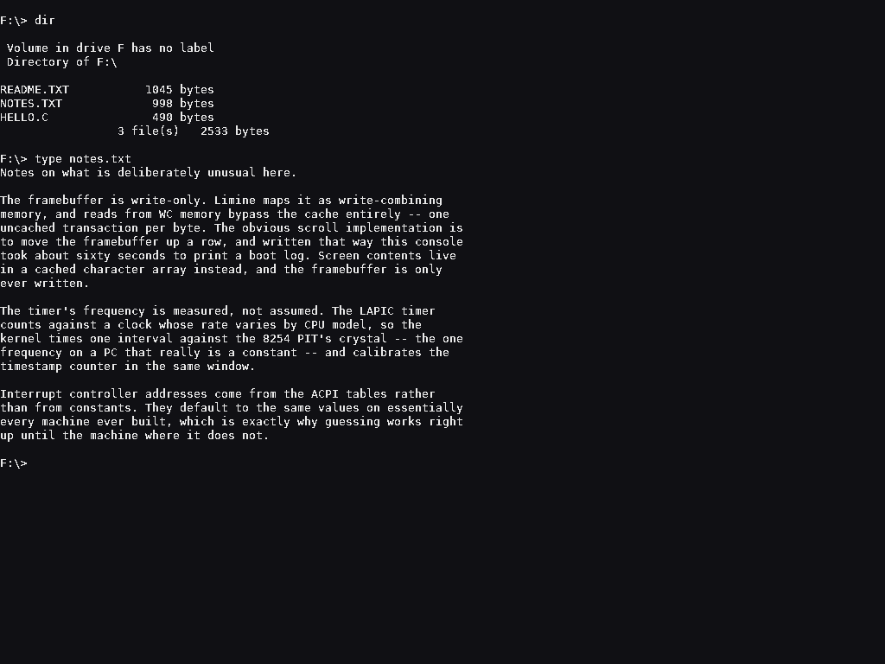
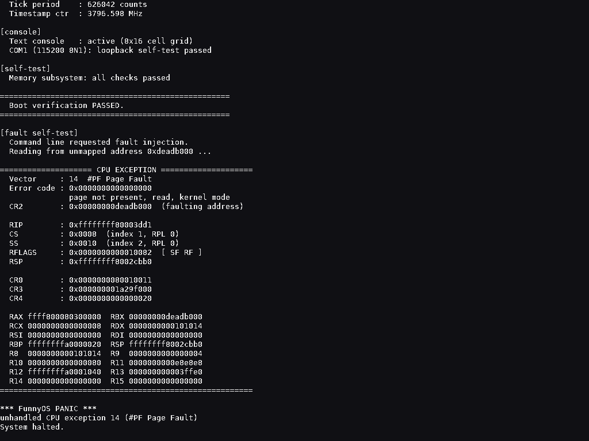
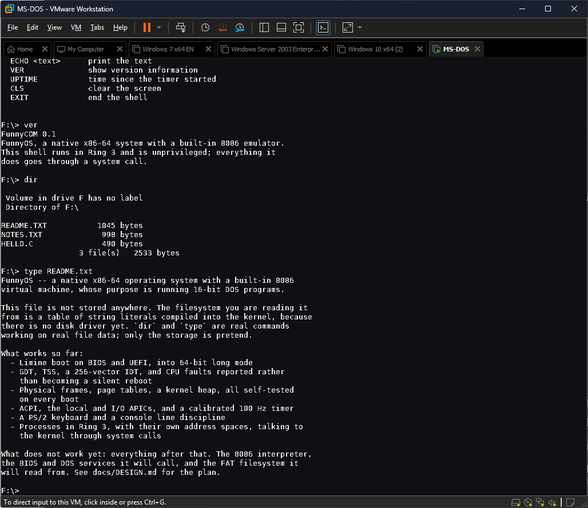

# FunnyOS

**中文** | [English](#english)

原生 x86-64 操作系统，内建 8086 虚拟机，以原生执行 16 位 DOS 程序为核心使命。

DOS 在这里扮演两重角色：**设计参照系**（继承小内核、直白分层、命令行交互的哲学，抛弃无内存保护、崩溃即整机崩溃的缺陷）和**测试语料库**（`microsoft/MS-DOS` 能编译出真实的 `.COM`/`.EXE`，是验证模拟器兼容性的现成素材）。

完整架构设计见 [docs/DESIGN.md](docs/DESIGN.md)（中文）。

---

## 当前状态

**M0（引导闭环）、M1（内核基础设施）与 M2（控制台与 Shell）已完成并通过验证。**

开机进入一个**交互式命令行**。Shell（FunnyCOM）是一个 **Ring 3 用户态进程**，跑在自己的地址空间里，所有能力都通过系统调用取得——它自己没有任何特权。

已经能跑的东西：

- **引导与内核**——Limine 双路径（BIOS/UEFI）进入 64 位长模式；GDT/TSS 与 256 项 IDT；CPU 异常被完整诊断（错误码解码、CR2、控制寄存器、全部通用寄存器），而不是三重故障后静默重启。
- **内存**——物理页帧分配器、页表管理（含 1 GiB / 2 MiB 大页拆分）、内核堆，每次启动跑一遍自检。
- **中断与时间**——解析 ACPI MADT 找出中断控制器（而非硬编码地址），初始化本地 APIC 与 I/O APIC，把 8259 PIC 重映射出异常向量区间后屏蔽；时间基准是 100 Hz 的 LAPIC 定时器，频率以 8254 PIT 晶振为参考**实测标定**，每次启动用 TSC 复核。
- **输入**——PS/2 键盘驱动，以及带回显与退格的行编辑。
- **进程**——Ring 3 执行、私有地址空间、`int 0x80` 系统调用、故障隔离、**浮点（x87 与 SSE）**。
- **文件**——一个只读的内存文件系统，文件内容就是编译进内核的字符串。
- **Shell**——`dir` / `type` / `echo` / `help` / `ver` / `uptime` / `cls` / `exit`。

### 最重要的一点

**一个程序崩溃只杀死它自己。** 这是 FunnyOS 明确背离 DOS 的地方，也是整套设计存在的理由。测试套件里有一个专门的用例：让 Shell 去写一块没有映射的地址，然后断言内核报告这次错误、结束那个进程、并继续运行。

测试规模：正常启动 25 项断言 × 两条固件路径，故障注入 9 项，键盘与 Shell 交互 17 项，用户程序 30 项（四种模式：正常启动、崩溃、主动退出、浮点自检）。此外构建本身会反汇编内核、校验它一个向量寄存器都没碰。全部由 `make check` 驱动。

| | 交互式 Shell | 程序崩溃 |
|---|---|---|
| 画面 |  |  |

同一个 ISO 在 **VMware Workstation** 里跑（BIOS 路径，非 QEMU）：



`make run` 可交互运行；`bash tools/screenshot.sh` 与 `bash tools/screenshot-shell.sh` 可无头截图。

下一步是 M3：8086 解释器核心。

## 构建环境

构建在 **WSL2 Ubuntu** 中进行。裸机 x64 的工具链在 Linux 上是原生的，这是最省事的路径。Visual Studio / MSVC 不适合裸机内核：无法完全控制链接布局，也没有关闭 CRT 与 SEH 的开关。

### 一次性环境准备

```bash
sudo apt-get update
sudo apt-get install -y build-essential nasm qemu-system-x86 xorriso mtools gdb ovmf
```

随后拉取 Limine 引导加载器（脚本幂等，可重复执行）：

```bash
bash tools/setup-limine.sh
```

### 构建与测试

```bash
make            # 构建内核与可引导 ISO
make check      # 跑全部测试（推荐，提交前跑一次）
make run        # 在带显示的 QEMU 中交互运行
make export     # 把 ISO 复制到 dist/ 目录
```

单独跑某一项：

```bash
make test       # 无头启动并断言（BIOS 路径）
make test-uefi  # 无头启动并断言（UEFI 路径）
make test-all   # 两条固件路径都测
make test-fault # 注入一次内核异常，检查诊断输出
make test-input # 用 QEMU 的 sendkey 敲键盘，跑一遍 Shell 会话
make test-user  # 三种方式结束一个用户进程：正常、崩溃、主动退出
make user       # 只构建用户态程序，不构建内核
```

`make test` 会自动优先使用 KVM 硬件加速，无 KVM 时回退到 TCG 软件模拟。

## 目录结构

```
FunnyOS/
├── boot/
│   ├── limine.conf              引导配置
│   └── limine/                  Limine 二进制与协议头文件（由脚本获取，不入库）
├── kernel/
│   ├── arch/x86_64/
│   │   ├── entry.asm            长模式入口（建立内核栈）
│   │   ├── gdt.c  idt.c  isr.c  描述符表与 CPU 异常诊断
│   │   ├── irq.c                中断处理程序登记、分发与 EOI
│   │   ├── acpi.c               ACPI MADT 解析（找出中断控制器）
│   │   ├── apic.c               本地 APIC 与 I/O APIC
│   │   ├── timer.c              LAPIC 定时器 + PIT 标定 + TSC
│   │   ├── fpu.c  fpu.asm       启用 x87/SSE，以及 FXSAVE/FXRSTOR
│   │   └── usermode.asm         iretq 进入 Ring 3，以及退出时的上下文恢复
│   ├── boot/bootinfo.c          Limine 引导请求与访问接口
│   ├── mm/
│   │   ├── pmm.c                物理页帧分配器（位图）
│   │   ├── vmm.c                页表管理、地址空间、大页拆分
│   │   └── heap.c               内核堆
│   ├── proc/
│   │   ├── process.c            进程：地址空间、加载、运行、结束
│   │   └── syscall.c            系统调用分发与用户指针校验
│   ├── fs/ramfs.c               只读内存文件系统（文件内容编译进内核）
│   ├── console/
│   │   ├── serial.c             16550 UART 驱动（含回环自检）
│   │   ├── fb.c                 帧缓冲文本控制台（光标、滚屏）
│   │   ├── font8x16.c           内建点阵字库（由脚本生成，勿手改）
│   │   ├── kbd.c                PS/2 键盘驱动与键码解码
│   │   ├── console.c            行编辑：回显、退格、长度限制
│   │   └── kprintf.c            输出分发：串口 + 帧缓冲双写
│   ├── include/funnyos/         内核头文件（含 syscall.h —— 两端共享的 ABI）
│   ├── main.c                   内核入口
│   └── panic.c                  致命错误处理
├── user/                        用户态程序（独立编译、链接，再嵌入内核）
│   ├── libu/                    用户态库：系统调用封装、缓冲输出
│   ├── funnycom/                FunnyCOM，就是那个 Shell
│   └── link.ld                  用户态链接脚本（固定加载到 4 MiB）
├── libk/                        内核基础库（内核与用户态各编译一次）
├── docs/
│   ├── DESIGN.md                架构设计文档
│   └── limine-*.md              Limine 协议、配置、用法文档（由脚本获取）
├── tools/
│   ├── setup-limine.sh          获取 Limine（幂等）
│   ├── run-qemu-test.sh         启动测试与断言
│   ├── run-fault-test.sh        内核异常注入测试
│   ├── run-input-test.sh        键盘与 Shell 交互测试
│   ├── run-user-test.sh         用户进程三种结束方式的测试
│   ├── screenshot.sh            无头截图（启动画面）
│   ├── screenshot-shell.sh      无头截图（Shell 会话中）
│   ├── bin2c.py                 把用户态程序转成内核里的字节数组
│   ├── check-no-vector-regs.sh  反汇编内核，确认它没碰向量寄存器
│   ├── gen-font.py              从 TTF 生成 8x16 点阵字库
│   ├── github-setup.sh          GitHub 仓库初始化
│   ├── fix-line-endings.sh      行尾符诊断与修复
│   └── wsl-env-check.sh         构建环境自检
├── linker.ld                    内核链接脚本
└── Makefile
```

## 五个必须知道的坑

以下四点都是实际踩出来的，不是理论风险。

### 1. 构建产物不在项目目录里

构建输出到 **`/var/tmp/funyos-build`**，而不是项目目录。这不是洁癖：

在 `/mnt/c`（9p 协议挂载）上由 WSL 创建的文件，如果 WSL 在数据真正落盘之前被终止，会进入一种损坏状态——Win32 API（`dir`、PowerShell `Get-ChildItem`）能列出文件、长度也正确，但 WSL 与 MSYS 的 `stat()` 一律返回 `ENOENT`，而且 `del` / `Remove-Item` 也删不掉。本项目实测已经产生过两个这样的幽灵文件（`funyos.elf` / `funyos.iso`），需要重启或 `chkdsk` 才能清除。

除可靠性之外，9p 上编译大量小文件也明显慢于原生文件系统。

源码仍然留在项目目录（Windows 侧可见、可版本控制），只有构建产物在 WSL 内部。

### 2. 内核编译期必须禁用 red zone 和向量寄存器

`-mno-red-zone` 和 `-mgeneral-regs-only` 不是可选优化：

- x86-64 的 red zone 假设栈指针之下 128 字节可以安全使用，而中断处理会破坏这个假设。
- 内核目前不保存 FPU/SSE 状态，编译器生成的任何浮点或向量指令都会在后续上下文切换时静默损坏数据。

这两个标志写在 `Makefile` 的 `CFLAGS` 里，不要移除。

### 3. 内核路径用 `fslabel()`，不要用 `boot()`

`boot():` 的含义是"引导驱动器上包含配置文件的那个分区"。这依赖 Limine 成功地把引导设备和某个可读卷对应起来。某些固件/虚拟机组合做不到，Limine 会警告：

```
Could not meaningfully match the boot device handle with a volume
```

然后回退到扫描含配置的卷。配置仍然找得到，但 `boot():` 不再可解析，内核于是打不开：

```
PANIC: Failed to open executable with path `boot():/boot/funyos.elf`
```

这在 VMware Workstation 上实测触发过（同样的镜像在 QEMU 里正常，所以本地测试抓不住）。改用 `fslabel()` 后，卷是靠 ISO 9660 卷标识符定位的，完全不经过引导设备匹配这一步。

标签由 `Makefile` 里的 `VOLID` 定义，构建时会校验镜像确实带上了它——因为标签对不上会造出一个"编译通过、测试通过、但无法引导"的镜像，这种失败模式最难排查。

同理，构建**不做** `limine bios-install`、也**不加** `--protective-msdos-label`：那是为"写入 U 盘当硬盘启动"准备的，会给镜像留下 DOS 分区表，让固件有机会把光盘误判成硬盘。需要 U 盘启动版本的话，把这两步加回去即可（`Makefile` 里有说明）。

### 4. 帧缓冲是 write-combining 内存：只能写，不能读

Limine 把所有 HHDM 区域映射为 write-back，**唯独帧缓冲区域用 write-combining (WC)**。这对帧缓冲是正确的选择，但有个锋利的副作用：**从 WC 内存读取会绕过缓存，每次读都是一次独立的、直通内存的事务。**

最自然的滚屏实现是把帧缓冲向上搬一行，也就是 `memmove` 3 MiB。最初就是这么写的，结果这个控制台打印一份启动日志要花大约 **60 秒**——因为光是"读"那一半，就是每滚一行约 300 万次不可缓存事务。

所以这里的帧缓冲是**只写**的。屏幕内容的权威副本保存在普通缓存数组 `g_cells` 里；滚屏只移动这个 6 KiB 的数组（几乎免费），然后整体重绘——重绘是纯写操作，正好是 WC 内存的快路径。同样一份日志现在 1 秒内打完。

往 [kernel/console/fb.c](kernel/console/fb.c) 里加任何东西都要守住这条：**永远不要读 `g_addr`。**

### 5. 内核绝不允许碰向量寄存器

**中断不保存 FPU/SSE 状态。** CPU 在中断时只压入通用寄存器和返回帧,XMM 和 x87 栈一概不管——这正是为了让「用不到它们的操作系统」可以完全跳过这件事。

所以内核**永远不能触碰向量寄存器**,`-mgeneral-regs-only` 就是保证这一点的手段。这不是风格偏好,而是整套设计成立的前提:正因为内核不碰,一个正在做浮点运算的程序被定时器中断打断时,它的 XMM 才能原封不动地留着。

**用户程序不受这条限制**——它们可以用 `float` / `double`。进程状态在控制权易手时用 FXSAVE/FXRSTOR 保存恢复;而中断期间不需要保存,因为内核根本不碰那些寄存器。这个不对称就是整个设计。

危险在于失败是**无声的**。如果有人把 `-mgeneral-regs-only` 从内核 CFLAGS 里删掉,每一次中断都会开始破坏被打断程序的数据——不报错,只是过一会儿某个结果变错,而且只在恰好被打断时才错。这种 bug 没人靠阅读能发现。

所以它是**机械校验**的,不是靠自觉:[tools/check-no-vector-regs.sh](tools/check-no-vector-regs.sh) 反汇编链接后的内核,只要出现一个向量寄存器就让构建失败。跑在内核**产物**上而不是源码上,因为源码可能完全无辜,而编译器有权把某个循环向量化。

顺带说明为什么没有 AVX:FXSAVE 的 512 字节镜像**不包含 YMM**,所以 `CR4.OSXSAVE` 被显式关闭。AVX 指令会触发 `#UD`——响亮地失败,而不是安静地漏掉一半状态。

## 设计要点速查

几个已经定死、后续不该反复推翻的决策（完整论证见 [docs/DESIGN.md](docs/DESIGN.md)）：

**DOS 程序用纯软件 8086 解释器执行。** 原因是硬件层面的：x64 长模式不提供 virtual 8086 模式；而硬件虚拟化要等到 Westmere 之后的 "unrestricted guest" + EPT 才能 VMEntry 进未开启分页的实模式 guest，且复杂度完全不成比例。

**模拟器运行在 Ring 3 用户态。** 解释器主循环的性能与特权级无关，但放在用户态几乎免费地获得了 MMU 隔离——一个 DOS 程序崩溃只杀死它自己。这是 FunnyOS 明确背离 DOS 的地方。

**中断采用 IVT 改写检测模型。** 天真地拦截所有 `INT n` 会让所有 TSR 常驻程序失效，因为 TSR 正是靠改写中断向量表来劫持系统调用的。

---
---

# English

[中文](#funnyos) | **English**

A native x86-64 operating system with a built-in 8086 virtual machine, whose core purpose is running 16-bit DOS programs natively.

DOS plays two roles here: a **design reference** (keeping the small kernel, the plain layering, the command-line philosophy; discarding the lack of memory protection and the fact that one crashing program takes down the machine) and a **test corpus** (the `microsoft/MS-DOS` sources compile into real `.COM`/`.EXE` binaries, which are excellent material for validating emulator compatibility).

See [docs/DESIGN.md](docs/DESIGN.md) for the full architecture (written in Chinese).

## Status

**M0 (boot chain), M1 (kernel infrastructure) and M2 (console and shell) are complete and verified.**

The machine boots into an **interactive command line**. The shell, FunnyCOM, is a **Ring 3 user-space process** with its own address space and no privileges of its own -- everything it does goes through a system call.

What works:

- **Boot and kernel** -- Limine on both BIOS and UEFI into 64-bit long mode; a GDT/TSS and a 256-vector IDT; CPU exceptions fully diagnosed (error code decoded, CR2, control registers, every general-purpose register) rather than becoming a triple fault and a silent reboot.
- **Memory** -- a physical frame allocator, page table management including 1 GiB and 2 MiB page splitting, and a kernel heap, all self-tested on every boot.
- **Interrupts and time** -- the ACPI MADT is parsed to find the interrupt controllers rather than hardcoding their addresses, the local and I/O APICs are brought up, and the 8259 pair is remapped out of the exception vector range and masked. The time base is the LAPIC timer at 100 Hz, *measured* against the 8254 PIT's crystal and re-checked against the TSC on every boot.
- **Input** -- a PS/2 keyboard driver, and a line discipline with echo and backspace.
- **Processes** -- Ring 3 execution, private address spaces, `int 0x80` system calls, fault isolation, and **floating point** (x87 and SSE).
- **Files** -- a read-only in-memory filesystem whose contents are string literals compiled into the kernel.
- **Shell** -- `dir`, `type`, `echo`, `help`, `ver`, `uptime`, `cls`, `exit`.

### The part that matters

**A crashing program kills only itself.** This is where FunnyOS deliberately departs from DOS, and it is the reason for the whole design. There is a test that makes the shell write to an address it has no mapping for, and asserts that the kernel reports the fault, ends that process, and carries on.

Test coverage: 25 assertions per boot path across both firmware types, 9 more for fault injection, 17 for keyboard and shell interaction, and 30 for user programs across four modes (normal startup, fault, deliberate exit, and a floating point check). The build itself additionally disassembles the kernel and verifies it touches no vector register. All driven by `make check`.

| | Interactive shell | Program crash |
|---|---|---|
| Screen |  |  |

The same ISO in **VMware Workstation** (BIOS path, not QEMU):


`make run` boots interactively; `bash tools/screenshot.sh` and `bash tools/screenshot-shell.sh` capture the screen headlessly.

Next up is M3: the 8086 interpreter core.

## Build environment

Building happens in **WSL2 Ubuntu**. Bare-metal x64 toolchains are native on Linux, which makes this the path of least resistance. Visual Studio / MSVC is a poor fit for a bare-metal kernel: it does not give full control over link layout and offers no clean way to disable the CRT and SEH.

### One-time setup

```bash
sudo apt-get update
sudo apt-get install -y build-essential nasm qemu-system-x86 xorriso mtools gdb ovmf
```

Then fetch the Limine bootloader (the script is idempotent and safe to re-run):

```bash
bash tools/setup-limine.sh
```

### Build and test

```bash
make            # Build the kernel and a bootable ISO
make check      # Run every test (use this before committing)
make run        # Run interactively in QEMU with a display
make export     # Copy the ISO into dist/
```

Individually:

```bash
make test       # Boot headless and assert (BIOS path)
make test-uefi  # Boot headless and assert (UEFI path)
make test-all   # Run both boot paths
make test-fault # Inject a kernel fault and check the diagnostic
make test-input # Type a shell session through QEMU's sendkey
make test-user  # End a user process three ways: normally, by fault, by exit
make user       # Build just the user program, without the kernel
```

`make test` prefers KVM hardware acceleration and falls back to TCG software emulation when KVM is unavailable.

## Project layout

```
FunnyOS/
├── boot/
│   ├── limine.conf              Boot configuration
│   └── limine/                  Limine binaries and protocol header (fetched, not committed)
├── kernel/
│   ├── arch/x86_64/
│   │   ├── entry.asm            Long mode entry point (sets up the kernel stack)
│   │   ├── gdt.c  idt.c  isr.c  Descriptor tables and CPU exception reporting
│   │   ├── irq.c                Interrupt handler registration, dispatch and EOI
│   │   ├── acpi.c               ACPI MADT parsing (locating the interrupt controllers)
│   │   ├── apic.c               Local APIC and I/O APIC
│   │   ├── timer.c              LAPIC timer, PIT calibration, TSC
│   │   ├── fpu.c  fpu.asm       Enabling x87/SSE, and FXSAVE/FXRSTOR
│   │   └── usermode.asm         iretq into Ring 3, and the context restore on exit
│   ├── boot/bootinfo.c          Limine boot requests and accessor interface
│   ├── mm/
│   │   ├── pmm.c                Physical frame allocator (bitmap)
│   │   ├── vmm.c                Page tables, address spaces, large-page splitting
│   │   └── heap.c               Kernel heap
│   ├── proc/
│   │   ├── process.c            Processes: address space, loading, running, ending
│   │   └── syscall.c            System call dispatch and user pointer validation
│   ├── fs/ramfs.c               Read-only in-memory filesystem
│   ├── console/
│   │   ├── serial.c             16550 UART driver with loopback self-test
│   │   ├── fb.c                 Framebuffer text console (cursor, scrolling)
│   │   ├── font8x16.c           Built-in bitmap font (generated; do not edit)
│   │   ├── kbd.c                PS/2 keyboard driver and scancode decoding
│   │   ├── console.c            Line discipline: echo, backspace, length limit
│   │   └── kprintf.c            Output fan-out: serial + framebuffer
│   ├── include/funnyos/         Kernel headers, including the shared syscall ABI
│   ├── main.c                   Kernel entry point
│   └── panic.c                  Fatal error handling
├── user/                        User programs, built and linked separately
│   ├── libu/                    User library: syscall wrappers, buffered output
│   ├── funnycom/                FunnyCOM, the shell
│   └── link.ld                  User linker script (linked at 4 MiB)
├── libk/                        Kernel support library (compiled for both sides)
├── docs/
│   ├── DESIGN.md                Architecture and design decisions
│   └── limine-*.md              Limine protocol, config and usage docs (fetched, not committed)
├── tools/
│   ├── setup-limine.sh          Fetch Limine (idempotent)
│   ├── run-qemu-test.sh         Boot test and assertions
│   ├── run-fault-test.sh        Kernel fault-injection test
│   ├── run-input-test.sh        Keyboard and shell interaction test
│   ├── run-user-test.sh         The three ways a user process can end
│   ├── screenshot.sh            Headless screendump of the boot
│   ├── screenshot-shell.sh      Headless screendump mid-shell-session
│   ├── bin2c.py                 Turn a user program into a byte array
│   ├── check-no-vector-regs.sh  Disassemble the kernel, prove it touches no XMM
│   ├── gen-font.py              Rasterise a TTF into the 8x16 bitmap font
│   ├── github-setup.sh          GitHub repository bootstrap
│   ├── fix-line-endings.sh      Line ending diagnostics and repair
│   └── wsl-env-check.sh         Build environment self-check
├── linker.ld                    Kernel linker script
└── Makefile
```

## Five things you need to know

All four were hit in practice, not theorised.

### 1. Build artifacts do not live in the project directory

Build output goes to **`/var/tmp/funyos-build`**, not the project directory. This is not tidiness:

A file created by WSL on `/mnt/c` (a 9p mount) becomes corrupted if WSL is terminated before the data actually reaches disk. The result is a file that Win32 APIs (`dir`, PowerShell `Get-ChildItem`) list with a correct size, but that WSL and MSYS `stat()` report as `ENOENT` — and that `del` / `Remove-Item` cannot remove either. Two such phantom files were produced here in practice (`funyos.elf` / `funyos.iso`); clearing them needs a reboot or `chkdsk`.

Separately, compiling many small files over 9p is noticeably slower than on a native filesystem.

Sources stay in the project directory (visible from Windows, suitable for version control); only build output lives inside WSL.

### 2. The kernel must disable the red zone and vector registers at compile time

`-mno-red-zone` and `-mgeneral-regs-only` are not optional optimisations:

- The x86-64 red zone assumes the 128 bytes below the stack pointer are safe to use, which interrupt handlers will clobber.
- The kernel does not save FPU/SSE state, so any floating point or vector instruction the compiler emits would silently corrupt data on the next context switch.

Both flags live in `CFLAGS` in the `Makefile`. Do not remove them.

### 3. The kernel path uses `fslabel()`, not `boot()`

`boot():` means "the partition holding the config file, on the boot drive". That depends on Limine successfully matching the device it was booted from with a readable volume. Some firmware/VM combinations fail that match, and Limine warns:

```
Could not meaningfully match the boot device handle with a volume
```

It then falls back to scanning for a volume containing a config. The config is still found, but `boot():` no longer resolves, and the kernel cannot be opened:

```
PANIC: Failed to open executable with path `boot():/boot/funyos.elf`
```

This was observed on VMware Workstation. The same image booted fine under QEMU, so local testing does not catch it. `fslabel()` sidesteps the whole thing: it locates the volume by its ISO 9660 volume identifier, with no boot-device matching involved.

The label comes from `VOLID` in the `Makefile`, and the build verifies the image actually carries it — because a mismatched label produces an image that compiles, passes every test, and then refuses to boot, which is the nastiest failure mode there is.

For the same reason the build does **not** run `limine bios-install` and does **not** pass `--protective-msdos-label`: those exist to make an image bootable as a hard disk (a USB stick), and they leave a DOS partition table behind that gives firmware the chance to mistake the optical disc for a hard drive. If you do want a USB-bootable image, add both back (`Makefile` explains where).

### 4. Framebuffer memory is write-combining: write it, never read it

Limine maps every HHDM region as write-back, with one exception: **framebuffer regions are mapped write-combining (WC)**. That is the right choice for a framebuffer, but it has a sharp edge: **reads from WC memory bypass the cache entirely and cost a full uncached transaction each.**

The obvious way to scroll is to move the framebuffer up by one text row, i.e. `memmove` 3 MiB. That is how this console was first written, and it took roughly **60 seconds** to print one boot log -- because the read half alone was about 3 million uncached transactions per scrolled line.

So the framebuffer here is **write-only**. The authoritative screen content lives in an ordinary cached array, `g_cells`; scrolling moves that 6 KiB array (effectively free) and then repaints, which is pure writes and therefore the fast path for WC memory. The same boot log now prints in under a second.

Anything added to [kernel/console/fb.c](kernel/console/fb.c) has to respect that: **never read from `g_addr`.**

### 5. The kernel must never touch a vector register

**An interrupt does not save floating point state.** The CPU pushes general purpose registers and the return frame, and nothing else -- XMM and the x87 stack are left alone, precisely so that an operating system which never uses them can skip the whole business.

So the kernel never touches a vector register, and `-mgeneral-regs-only` is what enforces that. It is not a style preference; it is the precondition the design rests on. Because the kernel leaves those registers alone, a program interrupted mid-calculation by a timer tick still has its XMM registers exactly where it left them.

**User programs are not bound by this** -- they may use `float` and `double`. A process's state is saved and restored with FXSAVE/FXRSTOR whenever control changes hands, and needs no saving across an interrupt because the kernel never disturbs it. That asymmetry is the whole arrangement.

The danger is that the failure is **silent**. Drop `-mgeneral-regs-only` from the kernel's CFLAGS and every interrupt starts corrupting the interrupted program's data -- no fault, just a wrong answer somewhere later, and only when the timing happens to be unlucky. Nobody finds that by reading.

So it is checked mechanically rather than trusted: [tools/check-no-vector-regs.sh](tools/check-no-vector-regs.sh) disassembles the linked kernel and fails the build if a single vector register appears. It runs on the built artifact rather than on the sources, because the C can be perfectly innocent and the compiler still be entitled to vectorise a loop.

This is also why there is no AVX: the 512-byte FXSAVE image does not cover YMM, so `CR4.OSXSAVE` is explicitly cleared. AVX instructions raise `#UD` -- a loud failure rather than quietly saving half the state.

## Design decisions at a glance

These are settled; the full reasoning is in [docs/DESIGN.md](docs/DESIGN.md).

**DOS programs run on a pure software 8086 interpreter.** The reason is a hardware one: x64 long mode does not provide virtual 8086 mode, and hardware virtualisation would need Westmere-era "unrestricted guest" plus EPT to enter a real-mode guest without paging enabled. The complexity is wildly out of proportion to the benefit.

**The emulator runs as a Ring 3 user-space process.** The interpreter's main loop performs identically regardless of privilege level, but running in user space buys MMU-enforced isolation for free — a crashing DOS program kills only itself. This is where FunnyOS deliberately departs from DOS.

**Interrupts use an IVT-rewrite detection model.** Naively intercepting every `INT n` would break every TSR, since TSRs hijack system calls precisely by rewriting the interrupt vector table.
